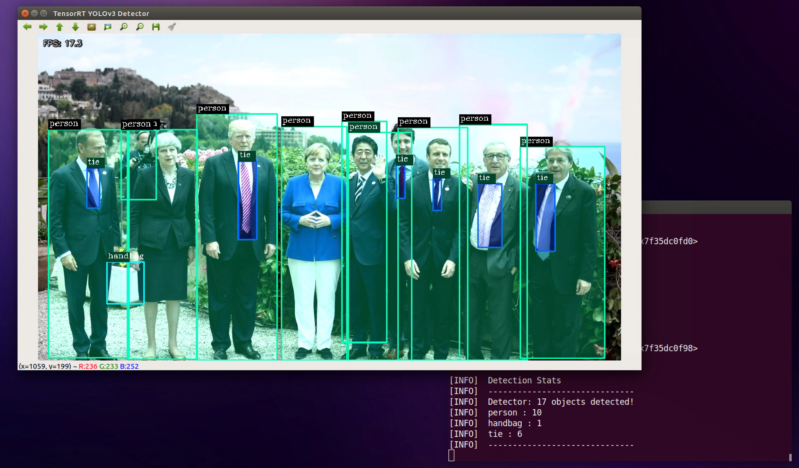

# TRT-yolov3

*** Copy Right 2020 Kevin Yu. All rights reserved.

*** Author: Kevin Yu

*** Update Time: 2020/06/02

As of today, YOLOv3 stays one of the most popular object detection model architectures. Since NVIDIA already provided an Object Detection With The ONNX TensorRT Backend In Python (YOLOv3) sample code, it is possibly to implement YOLOv3 with TensorRT to massively accelerate the inference runtime. This repo demonstrates an example to apply TensorRT techniques to real-time Object Detection with YOLOv3, and YOLOv3-tiny models.

I am working on adding the training tool to the repo so that you may implement TensorRT with YOLO models that are trained with custom dataset. It will be released soon.

**Notes:** All the demos below are done on my Jetson AGX Xavier DevKit. Here is the quick wrap-up from the demo results:

- Run the detector with **YOLOv3-416** model at **15~16 FPS** on Jetson AGX Xavier
- Run the detector with **YOLOv3-tiny-416** model at **46~53 FPS** on Jetson AGX Xavier

Furthermore, all demos should work on x86_64 PC with NVIDIA GPU(s) as well. Make sure you have all the software dependencies installed correctly on your machine.


Table of Contents
-----------------

* [Demo](#demo)
* [Dependencies](#dependencies)
* [Installation](#installation)
* [Usage](#usage)

Demo
----

The demos below are tested with the default YOLOv3-416 model, you may change to other models with flag **--model**. You may find all available models in **yolov3_onnx/**.

#### Demo 1: Detector with Image Input



#### Demo 2: Detector with Video Input


Dependencies
------------

The following packages are required for this project. If you are using a **x86 PC**, you have to make sure you have CUDA, cuDNN, and TensorRT installed.

For **Jetson User**, CUDA, cuDNN, and TensorRT are pre-installed with JetPack. Assuming you are using JetPack >=4.2, you should be good to go.

- Python>=3.6
- Onnx==1.4.1
- Protobuf==3.8.0
- Pycuda==2019.1.2
- OpenCV>=3.4
- CUDA>=10.0
- cuDNN>=7.5
- TensorRT>=6.0.1
- Numpy==1.16.0

**Notes:** You do not need to install the above dependencies separately, the installation script below will handle all the heavy-lifting installation work for you.

<a name="dependencies"></a>

Installation
------------

Simply run the following command, the script will lead you to the installation process.

```bash
$ bash <(wget -qO- https://raw.githubusercontent.com/yqlbu/TRT-yolov3/master/setup.sh)
```

**Notes:** 

- The script will run for around 10-15 minutes. Please wait with patience.
- If the script have successfully ran and finished without any errors, you may move on to test the results in the section below.

<a name="installation"></a>

Usage
-----

CLI (Command Line Interface) Reference:

|    flags   |                             usage                            |
|:----------:|:------------------------------------------------------------:|
|   --model  |                    chose a network to load                   |
|   --file   |  use a video file as input (remember to also set --filename) |
| --filename |                        video file name                       |
|    --usb   |          use USB webcam (remember to also set --vid)         |
|    --vid   |             device # of USB webcam (/dev/video?)             |
|   --rtsp   |          use IP Camera (remember to also set --uri)          |
|    --uri   |            RTSP URI, e.g. rtsp://192.168.1.64:554            |
|   --image  | use an image file as input (remember to also set --filename) |
|   --width  |                          image width                         |
|  --height  |                         image height                         |
|  --runtime |             display detailed runtime information             |

### Basic Usage

When the detector runs, the program would do the following:

>**(1)** deserialize/load the TensorRT engine

>**(2)** manage CUDA memory buffers using “pycuda”

>**(3)** preprocess input image, run inference and postprocess YOLOv3 detection output.

Below are the cases where you can run the detector with different input stream sources:

#### Run real-time detector with a webcam

```bash
$ python3 detector.py --usb --vid 0 --runtime
```

#### Run the detector with an input video file

```bash
$ python3 detector.py --file --filename ./data/videos/cars.mp4 --runtime
```

**Notes:** The project includes four sample videos for testing (cars.mp4, shinjuku.mp4, ped.mp4, and passby.mp4). They are located in **./data/videos/**

#### Run the detector with an image input

```bash
$ python3 detector.py --image --filename ./data/images/human.jpg
```

**Notes:** The project includes four sample images for testing (dog_1.jpg, dog_2.jpg, human.jpg). They are located in **./data/images/**

<a name="usage"></a>

#### Change input size

Simply add **--height** and **--width** flags to specify the size of the input frames

#### YOLOv3-tiny

To change the model to YOLOv3-tiny, specify the model with the flag **--model**

e.g. 

```bash
$ python3 detector.py --file --filename ./data/videos/cars.mp4 --model yolov3-tiny-416 --runtime
```

Training
--------

Coming soon, please stay tuned.

Reference
---------

This project is built based on the source code provide by Mr. JkJung, you may find his wonderful TensorRT Tutorial [HERE](https://jkjung-avt.github.io/tensorrt-yolov3/). I also referenced source code of [NVIDIA/TensorRT](https://github.com/NVIDIA/TensorRT) samples to develop the ONNX >> TensorRT conversion.

Source: [jkjung-avt tensorrt_demos](https://github.com/jkjung-avt/tensorrt_demos#yolov3)

Lisense
-------

[MIT License](https://github.com/yqlbu/TRT-yolov3/blob/master/LICENSE)